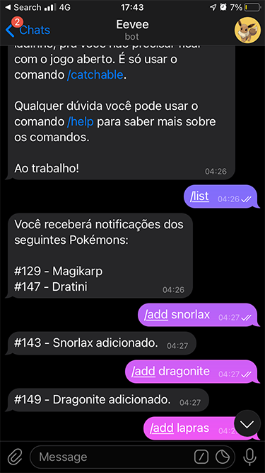
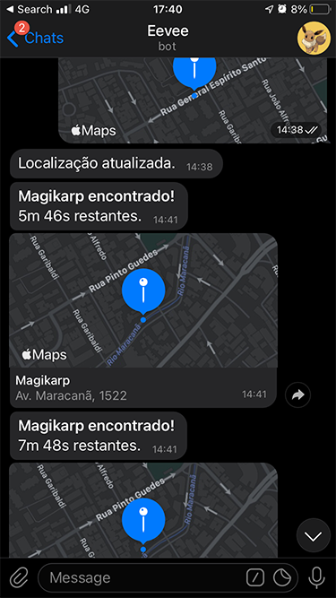

# eevee-bot

🇧🇷 Um chatbot no Telegram que te avisa quando surgir um pokémon próximo a você. 

🇬🇧 A Telegram chatbot that notifies you when a wild pokémon appears nearby.

# Usage

This is a webhook for [RocketMap](https://github.com/RocketMap/RocketMap). By default, it receives updates at `http://localhost:4000/`. You can change `config.ini` (make a copy from `config.ini.example`) or the command-line arguments to specify an authentication token (e.g. `my-secret-token-123456` so that it receives updates at `http://localhost:4000/my-secret-token-123456` instead).
